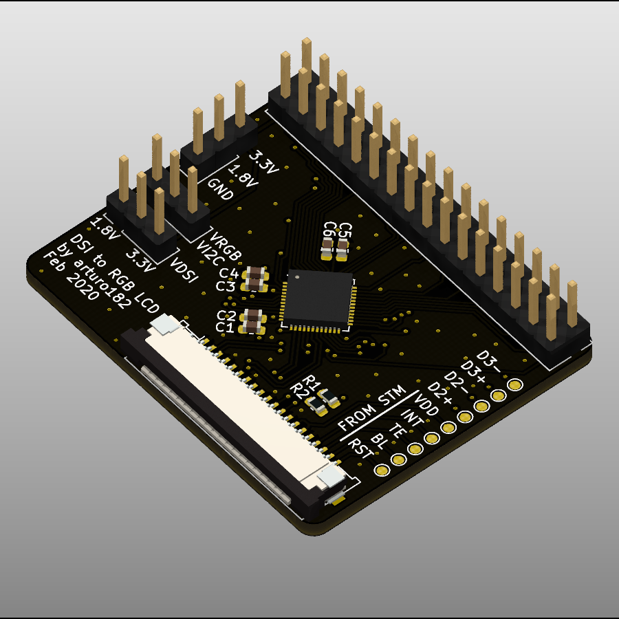
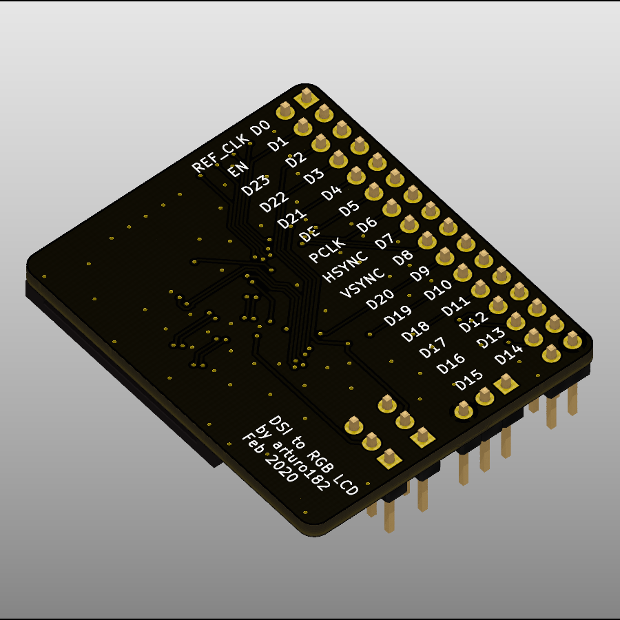

# ICN6211 MIPI DSI to RGB LCD Breakout

This is a breakout for ICN6211 MIPI DSI Bridge to RGB output.

The DSI connector is a 20 pin 1mm pitch designed to be used together with the STM32MP157A-DK1 board.